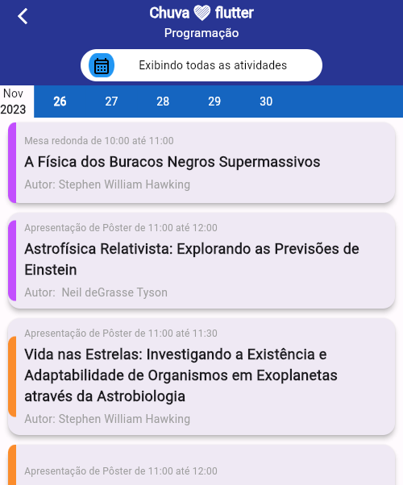
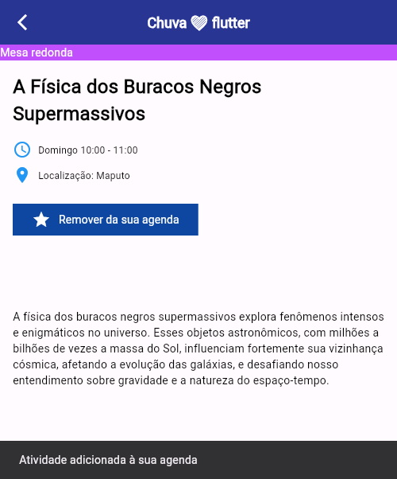

# Desafio Chuva 2024 Dart/Flutter
Implementação usando Dart e Flutter de um protótipo do Figma com algumas funcionalidades.

O projeto tem as seguintes features :
1. O projeto tem como design uma implementação próxima do [prótotipo figma](https://www.figma.com/file/imY9QQgNfBzPga9gkGLSRd/Chuva---Exerc%C3%ADcio-dart?type=design&node-id=0%3A1&mode=design&t=ckIi2VmeiZfBmT6v-1)
2. O projeto tem todos os dados renderizados a partir do arquivos [activities.json](https://raw.githubusercontent.com/chuva-inc/exercicios-2023/master/dart/assets/activities.json) e [activities-1.json](https://raw.githubusercontent.com/chuva-inc/exercicios-2023/master/dart/assets/activities-1.json)
3. Itens salvos são guardados na sessão.

### Estrutura do projeto
O projeto está estruturado em uma arquitetura "MVC". Dentro de lib existem 3 diretórios, *controller*, *model* e *pages*, apesar do nome diferente pages serve como view, todos os arquivos dentro dela retornam um _scaffold_ ou um _widget_ que é visual e poderá ser visto pelo usuario. Model contém classes com atributos que serão retirados do JSON, como atividade, autor etc. Controller possui os HTTP requests.

### Bibliotecas recomendadas x utilizadas :
| Biblioteca | Utilizada |
|------------|-----------|
|cached_network_image | ✅|
|dio| ✅|
|from_css_color|✅|
|go_router|✅|
|json_annotation|❌|

A biblioteca [shared_preferences](https://pub.dev/packages/shared_preferences) tambem foi utilizada!
Ela consegue salvar dados simples usando a o armazenamento persistente da plataforma da build, foi implementada para salvar atividades!

### Screenshots do programa em execução
#### Tela inicial

#### Pagina da atividade

#### Pagina do Autor
